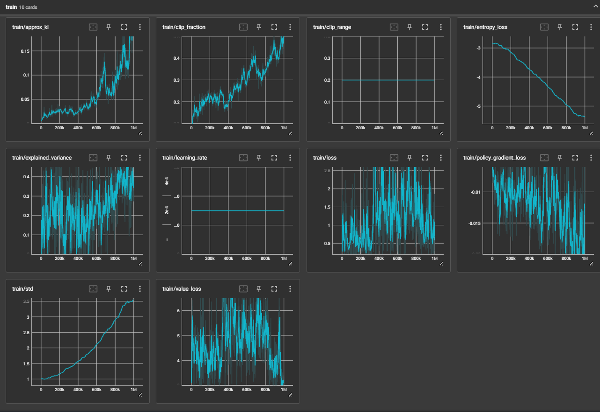
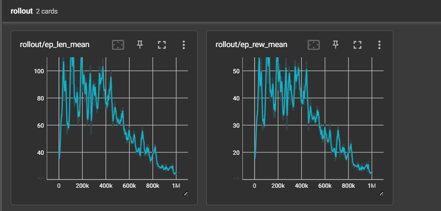
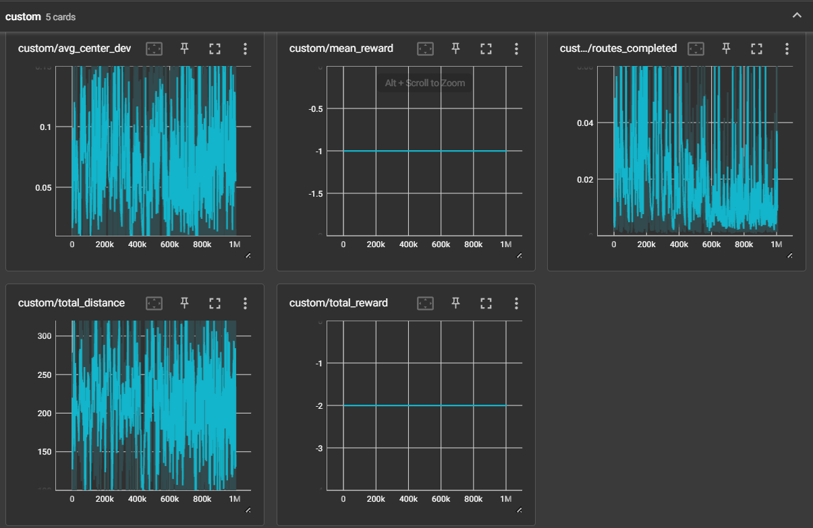
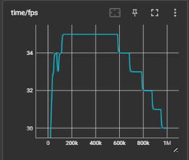

# 基于 PPO 算法的 CARLA 自动驾驶系统

## 项目简介

本项目基于 CARLA 0.9.15 仿真器，使用 PPO 强化学习算法训练自动驾驶智能体。智能体通过语义分割传感器感知环境，学习控制油门、刹车和方向盘，实现沿路径的自主行驶。本项目对原始 reward 函数进行了多项优化，使训练从无法收敛（ep_rew_mean ≈ 0）提升至 ep_rew_mean = 30.1。

## 硬件与开发环境

- **操作系统**: Windows 10
- **显卡环境**: RTX 4050 Laptop GPU (6GB)
- **仿真器版本**: CARLA 0.9.15
- **Python 版本**: 3.10
- **核心依赖**: PyTorch, Stable-Baselines3, Gym, NumPy
- **Conda 环境**: carla_rl

## 安装步骤

```bash
# 克隆仓库
git clone https://github.com/YuHang-Zhou/nn.git
cd nn

# 安装依赖
pip install -r src/auto_drive_system/requirements.txt
```

## 目录结构

```
src/auto_drive_system/
├── agent/              # 智能体相关代码
│   └── reward.py       # 奖励函数定义
├── carla_utils/        # CARLA 工具函数
├── core_rl/            # RL 核心训练逻辑
├── navigation/         # 导航模块
├── tools/              # 辅助工具
├── util/               # 通用工具函数
├── utilities/          # 工具类
├── config.py           # 配置文件（算法参数、奖励参数等）
├── train.py            # 训练入口脚本
├── carla_da_dynamic.py           # 动态数据增强
├── carla_da_dynamic_with_camera.py  # 摄像头动态数据增强
├── carla_da_static.py            # 静态数据增强
├── utils.py            # 环境封装与工具函数
└── requirements.txt    # 依赖列表
```

## 使用方法

### 训练

```bash
# 启动 CARLA 仿真器
./CarlaUE4.sh -RenderOffScreen

# 在本地运行训练
cd src/auto_drive_system
python train.py --host "localhost"

# 指定参数训练
python train.py --host "localhost" --town Town01 --total_timesteps 1000000 --fps 20
```

### 训练参数

| 参数 | 说明 | 默认值 |
|------|------|--------|
| `--host` | CARLA 服务器 IP | 远程 IP |
| `--port` | CARLA 服务器端口 | 2000 |
| `--town` | 训练地图 | Town01 |
| `--total_timesteps` | 总训练步数 | 1000000 |
| `--reload_model` | 加载已有模型继续训练 | None |
| `--fps` | 仿真帧率 | 20 |
| `--config` | 配置文件路径 | None |
| `--num_checkpoints` | 保存检查点数量 | 5 |
| `--no_render` | 关闭渲染 | False |

### 配置说明

配置文件位于 `config.py`，主要参数：

- **algorithm**: RL 算法选择（支持连续动作空间算法）
- **algorithm_params**: 算法超参数（详见 Stable-Baselines3 文档）
- **action_smoothing**: 是否启用动作平滑
- **reward_fn**: 奖励函数选择（见 `agent/reward.py`）
- **reward_params**: 奖励函数参数
- **obs_res**: 观测分辨率（推荐 160×80）

## 奖励函数优化

原始 reward 函数采用乘法组合（`speed × centering × angle`），存在以下问题：

### 修复的问题

1. **角度跨 0°/360° 计算 bug**: `wayp_angle=359, veh_angle=1` 时，`abs(359-1)=358`，导致角度因子错误归零。添加 `normalize_angle` 函数修复。
2. **速度奖励跳变**: 低速区间奖励从 -0.2 直接跳到正值，梯度信号不稳定。改为平滑线性插值。
3. **低速计时器累积 bug**: `low_speed_timer` 只加不减，应改为速度恢复时重置，实现"连续低速才终止"。
4. **终止惩罚固定**: 活 60 步和活 5 步终止惩罚相同（-1），改为随步数缩放。

### 优化策略

- **乘法改加权求和**: 每个维度独立梯度信号，不再一个维度归零就全部归零
- **加入低速惩罚**: 速度 < 5 km/h 直接扣分，防止"不动"策略
- **居中因子二次衰减**: 靠近中心时奖励更敏感，偏离时惩罚更猛
- **waypoint 前进奖励**: 为 reward_fn5 增加"往前开"的明确信号

## 训练结果

训练 100 万步后的关键指标：

| 指标 | 优化前 | 优化后 |
|------|--------|--------|
| ep_rew_mean | ≈ 0 | **30.1** |
| ep_len_mean | 极短 | **61.1** |
| avg_center_dev | - | **0.0821** |
| avg_speed | 0 | **1.91 km/h** |

<!-- TensorBoard 训练曲线截图 -->




<!-- 不管了，这里乱写 -->

## 运行效果

<!-- 训练过程动图 -->

<!-- 依旧乱写 -->

## 注意事项

- 本项目默认在双机模式下运行（一台跑 CARLA，一台跑 RL Agent），`--host` 参数默认为远程 IP。本地运行需设为 `localhost`。
- CARLA 仿真器建议使用 `-RenderOffScreen` 模式，减少 GPU 开销。
- 训练过程中建议开启 TensorBoard 监控：`tensorboard --logdir=./rl_sb3_carla_log`

---

