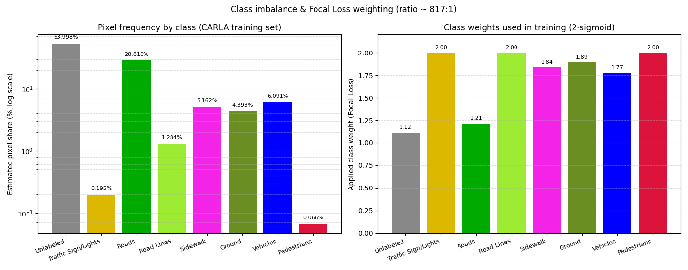

# 自动驾驶车辆语义分割


本项目为伍斯特理工学院（WPI）研究生课程 **RBE549 计算机视觉** 课程作业，团队以**语义分割**作为研究课题。项目基于 CARLA 自动驾驶仿真平台，通过自动化程序批量采集数千张带标注图像，构建语义分割专用数据集。

最终采用 **U-Net 网络模型**，结合**稀疏分类交叉熵焦点损失函数**开展训练，以此缓解各类别样本数量严重失衡的问题，优化数据集分布不均衡带来的模型偏差。模型将图像逐像素分为 8 类：未标注、交通标志/灯、道路、车道线、人行道、地面、车辆、行人。

## 运行效果图

输入一张 CARLA 街景图，模型输出语义分割叠加结果：

<p align="center">

</p>

纯掩码（蓝=车辆，绿=地面，黄=交通标志，红=行人）：

<p align="center">

</p>

也支持视频输入，逐帧分割后输出叠加视频。下图为视频中 6 个采样帧的分割结果：

<p align="center">

</p>

`--augment` 模式可视化训练时使用的 6 种数据增强（翻转/亮度/对比度/模糊/椒盐噪声/中心裁剪），便于直观了解模型为何对真实道路上的扰动具备一定鲁棒性：

<p align="center">

</p>

`--benchmark` 模式测量所有预训练模型在 CPU 上的推理延迟，便于按"速度 vs 精度"取舍：

<p align="center">

</p>

256x256 输入的模型比 512x512 的快 ~2.6 倍；512x512 的三个变体（基础、focal+权重、focal 无权重）速度几乎一致——它们计算量相同，差异仅在训练目标。

`--heatmap` 模式把模型 softmax 输出的 8 个类概率分别画成灰度热力图（亮 = 模型认为这里更可能属于该类），用来诊断模型对各类的把握程度：

<p align="center">

</p>

从上图可以直观看出 256x256 模型在 CARLA 示例上的偏置：对 Vehicles 和 Ground 高度自信（max≈1.0），但对 Roads（max≈0.09）和 Road Lines（max≈0.03）几乎检测不到，Pedestrians 的最高置信度也仅约 0.5——这与训练时类别极度不平衡（行人/标志像素数远少于道路）相吻合，也直接说明了项目使用 Focal Loss + 类别权重的必要性。

`--frequency` 模式将训练数据 8 类像素分布与训练实际使用的 Focal Loss 权重一并量化展示，用以解释"为什么需要 Focal Loss + 类别权重"：

<p align="center">

</p>

左图（对数纵轴）显示 Unlabeled 与 Roads 合计占 80% 以上的像素，而 Pedestrians 仅占约 0.066%、Traffic Sign/Lights 约 0.195%，**最多类与最少类的像素数比约 817:1**。如果用普通交叉熵直接训练，模型会被多数类主导、几乎不学少数类。右图显示训练时实际应用的权重——通过 `2·sigmoid(像素比例)` 把跨度 818:1 的不平衡压缩成 1.12-2.00 的温和加权（少数类 ≈2.0，多数类 ≈1.1），让模型在每张图的梯度中也能感知到少数类的存在。

## 运行环境

- 平台：Windows 10/11（Linux 同理）
- Python 3.10（TensorFlow 2.10 要求 Python 3.7–3.10）
- 纯 CPU 即可运行推理，无需 GPU

推荐用 conda 建独立环境：

```bash
conda create -n py310 python=3.10 -y
conda activate py310
cd src/auto_drive_seg
pip install -r requirements.txt
```

国内网络可加清华镜像：`pip install -r requirements.txt -i https://pypi.tuna.tsinghua.edu.cn/simple`

## 获取预训练模型

预训练模型为二进制大文件（每个约 17MB），未随本仓库提交。请从原始项目获取：

```bash
git clone https://github.com/hlfshell/rbe549-project-segmentation
```

将 `rbe549-project-segmentation/models/unet_model_256x256_50` 整个目录复制到本模块下的 `models/` 目录，最终结构为：

```
src/auto_drive_seg/models/unet_model_256x256_50/
    saved_model.pb
    keras_metadata.pb
    variables/
```

原仓 `models/` 下另有 `unet_model_512x512_50`、`unet_model_512x512_focal_loss_with_weights` 等更大输入尺寸的模型，可按需替换。

## 运行步骤

`main.py` 按输入文件扩展名自动识别图片或视频。

### 图片输入

```bash
cd src/auto_drive_seg
# 用自带示例图 + 默认 256x256 模型
python main.py

# 或指定输入图
python main.py examples/sample_input.png

# 或指定输入图和模型目录
python main.py examples/sample_input.png models/unet_model_512x512_50
```

运行后在输入图同目录生成 `*_overlay.png`（分割叠加图）和 `*_mask.png`（纯掩码图）。

### 视频输入

```bash
# 逐帧分割一段视频（.mp4/.avi/.mov/.mkv/.webm）
python main.py path/to/video.mp4

# 指定模型和最大处理帧数（默认 150 帧）
python main.py path/to/video.mp4 models/unet_model_256x256_50 120
```

视频为二进制大文件，不随仓库提交。可用原始项目 `examples/` 目录下的 `.mp4`（如 `movie1.mp4`）作测试。运行后在视频同目录生成 `*_seg.mp4`（逐帧分割叠加视频）和 `*_seg_frames.png`（采样帧拼图）。

### 数据增强可视化（--augment）

`semantic/unet/dataset.py` 训练时对每张图随机施加 6 种增强以缓解过拟合。`--augment` 模式分别对单张输入图独立施加每种增强并排展示（不需要模型）：

```bash
# 默认示例图
python main.py --augment

# 指定输入图
python main.py --augment examples/sample_input.png
```

运行后在输入图同目录生成 `*_augment.png`（4 列拼图，包含原图 + 6 种增强：水平翻转、亮度+30%、对比度-30%、高斯模糊、椒盐噪声 5%、中心裁剪 256）。

### 推理延迟基准测试（--benchmark）

把 `models/` 下能找到的预训练模型逐个加载（默认尝试这 4 个：`unet_model_256x256_50`、`unet_model_512x512_50`、`unet_model_512x512_focal_loss_with_weights`、`unet_512x512_focal_loss_no_weights`），每个先做 2 次预热再正式跑 10 次推理，输出柱状图与控制台 markdown 表格：

```bash
# 默认示例图
python main.py --benchmark

# 指定输入图
python main.py --benchmark examples/sample_input.png
```

运行后在输入图同目录生成 `*_benchmark.png`，控制台同时打印一份按平均耗时排序的表格（含每个模型的均值/最快/最慢/相对速度倍数）。

### 类别概率热力图（--heatmap）

把模型 softmax 输出的 8 个类（未标注/交通标志/道路/车道线/人行道/地面/车辆/行人）概率分别画成灰度热力图，每张面板带类名以及该类在整张图上的均值/最大值，便于判断模型对哪些类有把握、哪些类几乎检测不到：

```bash
# 默认示例图 + 默认 256x256 模型
python main.py --heatmap

# 指定输入图
python main.py --heatmap examples/sample_input.png

# 指定输入图与模型
python main.py --heatmap examples/sample_input.png models/unet_model_512x512_50
```

运行后在输入图同目录生成 `*_heatmap.png`（4 列 × 2 行的 8 类概率热力图）。

### 类别频率分析（--frequency）

不依赖任何模型或输入图，直接读取 `semantic/unet/train.py` 中由原始项目从 CARLA 训练集统计得到的 `CLASS_PIXEL_RATIOS`，量化展示数据极度不平衡，以及 Focal Loss 应用权重如何缓解：

```bash
python main.py --frequency
```

运行后：
- 控制台打印 8 类的 markdown 表格（每类的像素比例常量、估计像素占比、训练实际使用的 Focal Loss 权重）以及最大/最小类的比例
- 在 `examples/sample_input_frequency.png` 生成两栏柱状图（左：log 纵轴的像素占比；右：训练时使用的类别权重）

## 目录说明

```
src/auto_drive_seg/
    main.py                 推理入口（模块入口，须以 main. 开头）
    requirements.txt        依赖
    semantic/               推理所需代码（U-Net 模型/数据加载/可视化/类别定义）
        unet/               模型结构、数据集、训练、可视化工具
        carla_controller/   CARLA 语义类别与颜色映射
    examples/               示例输入图与运行效果图（图片 + 视频采样帧）
    models/                 预训练模型（需自行获取，见上）
```

> 说明：原始项目中 `semantic/carla_controller/` 还含有 CARLA 数据采集脚本（依赖 `carla` 包与运行中的仿真器），与推理无关，本模块未收录。训练数据集需通过 CARLA 仿真器实跑采集，详见原始项目。

---

### 专业术语对照

1. Semantic Segmentation：语义分割
2. CARLA：卡拉自动驾驶仿真平台（通用专有名词不译）
3. U-Net：U 型网络（经典分割模型，保留原名）
4. sparse categorical cross entropy focal loss：稀疏分类交叉熵焦点损失
5. class imbalance：类别不平衡
6. hyperparameter：超参数